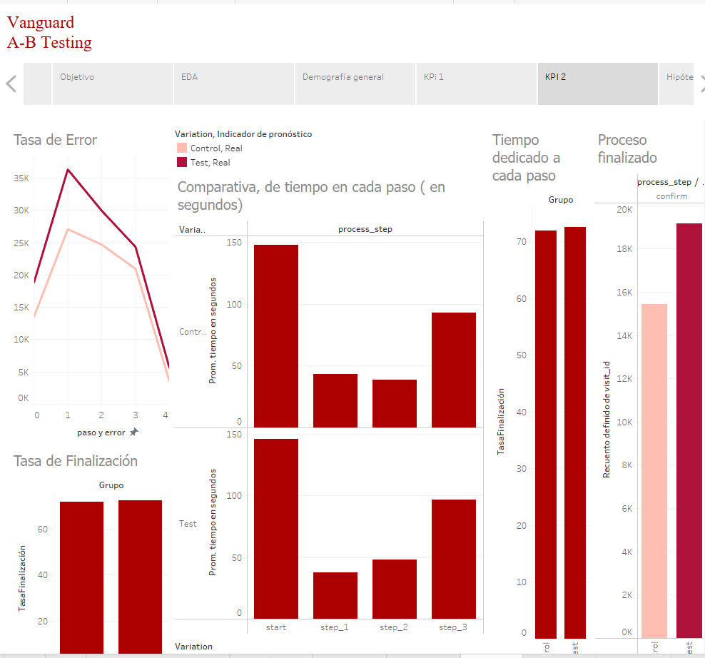

# 📊 A-B-Testing-Vanguard

## Proyecto de Experiencia del Cliente (CX) de Vanguard

### Introducción

El equipo de Experiencia del Cliente (CX) de Vanguard, una empresa líder en gestión de inversiones con sede en EE. UU., ha llevado a cabo un experimento digital para evaluar el impacto de una nueva interfaz de usuario (IU) en la experiencia del cliente. Este proyecto busca determinar si una IU más intuitiva y moderna, junto con indicaciones contextuales oportunas, mejora las tasas de finalización del proceso en línea.

### Distribución de Cuadernos Jupyter

Las acciones de Análisis Exploratorio de Datos (EDA) están divididas en distintos cuadernos Jupyter numerados para facilitar su visualización paso a paso:

1. [**1_Examinar_datos:** Exploración inicial del conjunto de datos.](./1_Examinar_datos.ipynb)
2. [**2_Limpieza:** Procesos de limpieza y transformación de datos.](./2_Limpieza.ipynb)
3. [**3_Estadísticos:** Análisis estadísticos descriptivos.](./3_Estadísticos.ipynb)
4. [**4_KPI_Métricas_de_rendimiento:** Evaluación de KPI y métricas de rendimiento.](./4_KPI_Métricas_de_rendimiento.ipynb)
5. [**5_Pruebas_Hipótesis:** Realización de pruebas de hipótesis.](./5_Pruebas_Hipótesis.ipynb)
6. [**6_Evaluación_experimento:** Evaluación final del experimento.](./6_Evaluación_experimento.ipynb)

### Distribución de Carpetas

Para una mejor organización y manejo de los datos, hemos dividido los archivos CSV en dos carpetas:

- **DATOS:** Contiene los archivos CSV originales con los datos sin procesar.
- **Datos limpios:** Incluye los archivos CSV que han sido procesados y limpiados para su uso en el análisis.


### Contexto

En un mundo digital en constante evolución, los clientes de Vanguard también cambian. Vanguard consideró que una IU mejorada, acompañada de señales contextuales (mensajes, sugerencias o instrucciones proporcionadas directamente a los usuarios en el contexto de su tarea actual), podría hacer que el proceso en línea fuera más sencillo y eficiente para los clientes.

## Objetivo

El objetivo fundamental del experimento es determinar si estos cambios en la IU alentarían a más clientes a completar el proceso en línea.

## El Experimento Realizado

### Prueba A/B

Se llevó a cabo una prueba A/B del 15 de marzo de 2017 al 20 de junio de 2017 para comparar el proceso en línea tradicional con la nueva interfaz digital mejorada.

- **Grupo de Control:** Clientes que interactuaron con el proceso en línea tradicional de Vanguard.
- **Grupo de Prueba:** Clientes que experimentaron la nueva interfaz digital mejorada.

### Secuencia del Proceso

Ambos grupos navegaron a través de una secuencia de proceso idéntica:
1. **Página inicial**
2. **Tres pasos subsiguientes**
3. **Página de confirmación que señalaba la finalización del proceso.**

### Objetivo del Experimento

Evaluar si el nuevo diseño conduce a una mejor experiencia de usuario y mayores tasas de finalización del proceso.

### Resultados del Análisis

**Tasa de Finalización**
- **Tasa de Finalización (Test):** 72.56%
- **Tasa de Finalización (Control):** 71.93%
  
  **Conclusión:** El nuevo diseño ha mostrado una ligera mejora en la tasa de finalización.

**Permanencia Promedio**
- **Permanencia promedio del grupo de prueba:** 151.69
- **Permanencia promedio del grupo de control:** 151.46
- **Estadístico de prueba:** 0.71
- **Valor p:** 0.48
  
  **Conclusión:** No hay una diferencia significativa en la permanencia promedio entre los grupos.

**Edad Promedio**
- **Edad promedio del grupo de prueba:** 48.79
- **Edad promedio del grupo de control:** 48.20
- **Estadístico de prueba:** 9.51
- **Valor p:** 2.01e-21
  
  **Conclusión:** Existe una diferencia significativa en la edad promedio entre los grupos, lo que indica un posible sesgo en la asignación de los clientes.

**Tasa de Error**
- **Tasa de Error (Test):** 13.50%
- **Tasa de Error (Control):** 11.05%
  
  **Conclusión:** El nuevo diseño tiene una mayor tasa de errores, lo que sugiere problemas de usabilidad.

**Duración Promedio por Paso**
```plaintext
Proceso       | Duración Promedio Test | Duración Promedio Control
------------- | ---------------------- | -------------------------
Confirmación  | 59.15                  | 68.79
Inicio        | 53.19                  | 40.12
Paso 1        | 22.71                  | 28.47
Paso 2        | 33.69                  | 31.41
Paso 3        | 67.54                  | 65.71
 
**Conclusión:** Los tiempos varían entre los pasos del proceso, con algunos pasos siendo más rápidos en el grupo de prueba y otros más rápidos en el grupo de control.

### **Conclusión General**
El nuevo diseño (Test) ha mejorado la tasa de finalización, pero presenta una mayor tasa de errores y una diferencia en la edad promedio entre los grupos, lo que sugiere un posible sesgo. Sería necesario ajustar el diseño para mejorar la usabilidad y asegurar una asignación más equitativa de los clientes.


## Visualización Interactiva

En el desarrollo de este proyecto, hemos utilizado Tableau para crear una serie de visualizaciones interactivas que facilitan la comprensión de los resultados del experimento A/B. Tableau nos ha permitido analizar y visualizar datos complejos de manera intuitiva y efectiva. Dentro de este repositorio, se incluye el archivo de Tableau, el cual contiene todas las gráficas y paneles de control utilizados en el análisis. Invitamos a los usuarios a explorar el archivo de Tableau para obtener una visión detallada y dinámica de los datos.




## Contacto
📧 **Email:** cris.puertascamarero@gmail.com